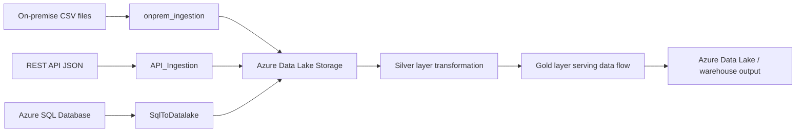

# Azure-End-to-End-Data-Engineering-Pipeline

This repository contains an Azure Data Factory (ADF) project designed to ingest data from multiple sources, transform it, and load it into Azure storage and Azure SQL Database. The project uses a combination of copy activities, lookup activities, and mapping data flows to move and process data end-to-end.

## Project Overview

This project demonstrates an end-to-end data engineering workflow for airline and booking data. It ingests source files from an on-premise file location, pulls JSON data from a public API, and copies data from an Azure SQL Database into a data lake for further processing.

The repository includes:
- Azure Data Factory pipelines for orchestration
- Linked services for Azure SQL, ADLS Gen2, on-premise file access, and GitHub
- Datasets for source and sink definitions
- Data flows for cleaning and transformation
- A parent orchestration pipeline that executes multiple child pipelines

## Technologies Used

- Azure Data Factory
- Azure SQL Database
- Azure Data Lake Storage Gen2 (Azure Blob FS)
- Mapping Data Flows
- JSON configuration files
- GitHub repository integration for ADF publish workflow
- On-premise file access via file server integration

## Architecture / Data Flow

The project follows a multi-source ingestion and transformation pattern:



## Project Workflow

1. On-premise CSV files are copied into the data lake using the `onprem_ingestion` pipeline.
2. API data is fetched using a Web Activity and copied into the data lake using the `API_Ingestion` pipeline.
3. Azure SQL data is loaded incrementally using `SqlToDatalake` with a lookup-based watermark approach.
4. The `Silverlayer` pipeline executes the `dataTransFormation` mapping data flow.
5. The `goldlayer` pipeline executes the `dataserving` mapping data flow.
6. The `parent_pipeline` orchestrates these steps in sequence.

## Azure Data Factory Components Used

### Pipelines
- `parent_pipeline`
- `onprem_ingestion`
- `API_Ingestion`
- `SqlToDatalake`
- `Silverlayer`
- `goldlayer`
- `pipeline1`

### Data Flows
- `dataTransFormation`
- `dataserving`

### Linked Services
- `ls_azursql` - Azure SQL Database connection
- `ls_datalake` - Azure Blob FS / ADLS Gen2 connection
- `ls_github` - GitHub related connection
- `ls_onprem_file` - File server connection

### Datasets
The repository contains several datasets such as:
- `ds_api_source`
- `ds_api_sink`
- `ds_sqlsource`
- `ds_sql`
- `ds_onprem_src_param`
- `ds_onpremsink_csv`
- `ds_lookup`
- `ds_emptyjson`
- `ds_silver_src`
- `ds_dimflight_src`
- `ds_dimpassenger_src`
- `ds_dimairport`
- `ds_fact_src`

## Source and Destination

### Source Systems
- On-premise CSV files for dimension data
- REST API endpoint for airport data
- Azure SQL Database table `dbo.FactBookings`

### Destination Systems
- Azure Data Lake Storage (`ls_datalake`)
- Azure SQL Database (`ls_azursql`)
- Data lake folders such as `silver` and transformed output destinations

## ETL Process

The project follows an ETL pattern using Azure Data Factory activities:

- Extract
  - Copy data from CSV files, API JSON, and Azure SQL Database
- Transform
  - Use mapping data flows to clean and standardize fields
  - Rename columns, convert values, filter rows, and cast data types
- Load
  - Write transformed data to Delta-based storage and targeted output locations

Examples of transformations present in the repository include:
- Uppercasing country values
- Replacing gender values (`M` to `Male`, `F` to `Female`)
- Filtering passenger records where age is greater than 25
- Creating a first name field from the full name
- Casting ticket cost values
- Lowercasing airport names

## Pipeline Details

### 1. `parent_pipeline`
This is the main orchestration pipeline. It executes multiple child pipelines in sequence:
- `onprem_ingestion`
- `API_Ingestion`
- `SqlToDatalake`

It also contains a `FailureAlert` Web Activity that posts status information to a downstream endpoint.

### 2. `onprem_ingestion`
This pipeline iterates through a set of file names and copies them from a file server to Azure Data Lake Storage. It uses parameterized file names and mapping definitions for each dataset.

### 3. `API_Ingestion`
This pipeline calls a REST API via a Web Activity and then copies the returned JSON content to a sink dataset in the data lake.

### 4. `SqlToDatalake`
This pipeline performs incremental loading from Azure SQL Database to the data lake using:
- `Lastload` lookup
- `LatestLoad` lookup
- `CopySqlData` copy activity
- `watermark` copy activity

It reads records where `booking_date` is greater than the last watermark and writes the data to Parquet format.

### 5. `Silverlayer`
This pipeline executes the `dataTransFormation` mapping data flow and writes data into the `silver` file system using Delta format.

### 6. `goldlayer`
This pipeline executes the `dataserving` data flow and is designed to serve transformed data for downstream use.

## Project Structure

```text
AzureDataFactory_Project/
├── README.md
├── publish_config.json
├── linkedService/
│   ├── ls_azursql.json
│   ├── ls_datalake.json
│   ├── ls_github.json
│   └── ls_onprem_file.json
├── dataset/
│   ├── ds_api_source.json
│   ├── ds_api_sink.json
│   ├── ds_sqlsource.json
│   ├── ds_sql.json
│   ├── ds_lookup.json
│   ├── ds_emptyjson.json
│   ├── ds_silver_src.json
│   ├── ds_dimflight_src.json
│   ├── ds_dimpassenger_src.json
│   ├── ds_dimairport.json
│   ├── ds_fact_src.json
│   └── ds_onprem_src_param.json
├── pipeline/
│   ├── parent_pipeline.json
│   ├── onprem_ingestion.json
│   ├── API_Ingestion.json
│   ├── SqlToDatalake.json
│   ├── Silverlayer.json
│   ├── goldlayer.json
│   └── pipeline1.json
├── dataflow/
│   ├── dataTransFormation.json
│   └── dataserving.json
├── factory/
├── integrationRuntime/
└── ...
```

## How to Run / Use the Project

1. Open the Azure Data Factory instance in the Azure portal.
2. Ensure the linked services are configured with valid Azure and SQL credentials.
3. Validate that the Azure Data Lake Storage and Azure SQL Database resources exist and are accessible.
4. Publish or validate the pipelines in Azure Data Factory.
5. Run the `parent_pipeline` to execute the complete data ingestion and transformation flow.

For Azure Data Factory Git integration, the repository includes a publish configuration:

```json
{"publishBranch":"adf_publish","enableGitComment":true}
```

## GitHub Integration

This project is configured for Git-based Azure Data Factory publishing. The repository includes GitHub-based integration and a publish branch configuration:
- `publishBranch`: `adf_publish`
- `enableGitComment`: `true`

This is aligned with the Azure Data Factory repository setup present in the project.

## Key Learnings

- Designing end-to-end ETL orchestration in Azure Data Factory
- Combining file, API, and SQL-based ingestion within one solution
- Using lookup activities and watermark logic for incremental loading
- Transforming raw data through multiple layers using data flows
- Working with parameterized datasets and dynamic pipeline execution
- Structuring engineering projects for future analytics and reporting workloads

## Future Improvements

- Add stronger validation and data quality checks between raw and transformed data
- Expand the gold layer with additional processing and aggregation logic
- Improve monitoring and alerting for pipeline failures
- Add more formal documentation for schema and data lineage
- Extend the project with additional datasets or integration patterns if required by the downstream use case

## Author

Vikash1440

This project is a practical Azure Data Engineering portfolio project that demonstrates ETL orchestration and data movement using Azure Data Factory.
